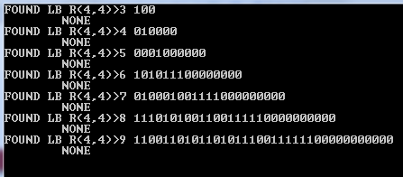

RamSearch
=========

This is a small class project to find Ramsey numbers of the form **R(q,q)** by brute force search.  The algorithm is simple:

	// set n := known number below ub
	while (!found_ub) {
		gr_init(&gr, n);
		do {
			gr_search(&gr, qboth);
			gr_incr(&gr);
		} while (gr.foundki != NONE && !gr_allzero(&gr));
		  // in english: while we haven't found a bad graph
		  // (a graph with no q-sub-clique or q-sub-independent-set)
		  // and we haven't yet searched through every possible graph
	
		// if we searched through all graphs size n
		if (gr.foundki != NONE) { 
			found_ub = true;
		} else {
			// otherwise, we found a bad graph
			// --> n is a lower bound
		}
		gr_free(&gr);
	
		n++;
	}

Bonus: The implementation is parallelized using **[OpenMP](www.openmp.org)**.

Developed in Microsoft Visual Studio.

### Results
Proof that R(4,4) > 9:
 

(the 1s and 0s are encoded adjacency matrices for the found bad graph counterexample)

### Future Work
Naturally RamSearch has plenty of room for optimization, especially taking advantage of symmetry in graphs and other isomorphisms.  In my next project, however, I will take the approach of randomly sampling graphs.

### Matlab RandomRamSearch
[Margaret Vulih](mvulih@stevens.edu) wrote a Matlab script to find lower bounds on Ramsey numbers by stochastic means.  It's a bit finicky, but you can play with it in the `RandomRamSearch` folder.

